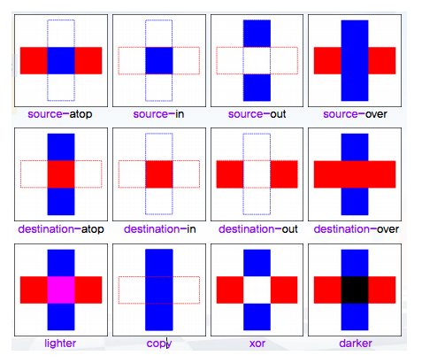

# (MDN) 캔버스 기본 사용법 정리

# 00 - 캔버스 헨드북

* 사각형 그리기
  * ``ctx.fillRect(x, y, width, height)``
  * ``ctx.strokeRect(x, y, width, height)``
  * ``ctx.clearRect(x, y, width, height)``

<br />

* 펜 이동하기
  * ``ctx.moveTo(x, y)``

<br />

* 선 그리기
  * ``ctx.beginPath()``
  * ``ctx.lineTo(x, y)``
  * ``ctx.closePath()``
  * ``ctx.rect()``
  * ``ctx.stroke()``
  * ``ctx.fill()``

<br />

* 호 그리기
  * ``ctx.arc(x, y, radius, startAngle, endAngle, anticlockwise)``
  * ``ctx.arcTo(x1, y1, x2, y2, radius)``

<br />

* 베지어 곡선과 이차 곡선 그리기
  * ``quadraticCurveTo(cp1x, cp1y, x, y)``
  * ``bezierCurveTo(cp1x, cp1y, cp2x, cp2y, x, y)``

<br />

* ``Path2D`` 객체
  * ``new Path2D()``
  * ``path2d.선_그리기_메서드()``


<br /><hr /><br />


# 01 - 캔버스 기본 사용법

```javascript
/** @type { HTMLCanvasElement } */
const canvas = document.querySelector("캔버스 요소 선택자");

/** @type { CanvasRenderingContext2D } */
const ctx = canvas.getContext("2d");
```


<br /><hr /><br />


# 02 - 캔버스에 도형 그리기

## 02-01 - 직사각형 도형 예제

```javascript
// 색칠된 직사각형을 그립니다.
ctx.fillRect(x, y, width, height);

// 직사각형 윤곽선을 그립니다.
ctx.strokeRect(x, y, width, height);

// 특정 부분을 지우는 직사각형이며, 이 지워진 부분은 완전히 투명해집니다.
ctx.clearRect(x, y, width, height);
```


<br /><br />


## 02-02. ``path (경로)`` 그리기

``path (경로)`` 는 유일한 원시적인 (primitive) 도형 입니다.

``path (경로)`` 는 ``점`` 들의 집합이며, 복잡한 도형을 만들 수 있습니다.

<br />

``path (경로)`` 를 사용하여 도형을 만들 때, 다음과 같은 과정이 필요합니다.

1. ``path (경로)`` 를 생성합니다.
2. ``그리기 명령어`` 를 사용하여 경로상에 그립니다.
3. 그려진 ``path (경로)`` 를 실제로 그리기 위해, ``렌더링 명렁어`` 를 사용합니다. (채우기, 윤곽선)

```javascript
// 1. ``path (경로)`` 를 생성합니다.
ctx.beginPath();

// 2. ``그리기 명령어`` 를 사용하여 경로상에 그립니다.
// 2-1. 현재 하위 경로의 시작 부분과 연결된 직선을 추가 합니다. (경로 닫기)
ctx.closePath();

// 2-2. 윤곽선을 사용하여 도형을 그립니다. (렌더링 명령어)
ctx.stroke();

// 2-3. path (경로) 의 내부를 채워서, 내부가 채워진 도형을 그립니다. (렌더링 명령어)
ctx.fill();
```


<br /><br />


## 02-03. ``펜(pen)`` 이동하기

``펜(pen)`` 을 이동한다는 것은, 실제 그리지는 않지만 ``펜(pen)`` 의 위치를 옮기는 행위 입니다.

``Canvas`` 에서는 ``moveTo(x, y)`` 메서드가 ``펜(pen)`` 이동하기 기능을 제공 합니다.

<br />

``moveTo(x, y)`` 메서드는 그림을 그릴 시작점으로 이동하기 위해 자주 사용하게 될 메서드 입니다.

```javascript
ctx.moveTo(x, y);
```


<br /><br />


## 02-04. 선

직선을 그리기 위해서는 ``lineTo(x, y)`` 메서드를 사용할 수 있습니다.

``펜(pen)`` 의 ``현재 위치`` 에서 시작하여 ``lineTo(x, y)`` 의 좌표까지 직선을 그립니다.

<br />

``lineTo(x, y)`` 로 그린 직선들은 ``fill()`` 또는 ``stroke()`` 로 도형을 그릴 수 있습니다.

``fill()`` 메서드는 ``path(경로)`` 가 닫혀있지 않아도 ``시작점 - 끝점`` 을 연결하여 채워진 도형을 그려줍니다.

하지만, ``stroke()`` 메서드는 ``path(경로)`` 에 윤곽선을 그리는 기능이기 때문에, 도형을 완성시켜주지 않습니다.

따라서 윤곽선 도형을 그리기 위해서는, 마지막에 ``closePath()`` 메서드로 ``시작점 - 끝점`` 을 연결해주어야 합니다.

```javascript
ctx.beginPath();
ctx.moveTo(50, 25);
ctx.lineTo(75, 75);
ctx.lineTo(25, 75);
ctx.closePath();
ctx.stroke();
```


<br /><br />


## 02-05. 호 (arc)

``호`` 나 ``원`` 을 그리기 위해서는 ``arc()`` 또는 ``arcTo()`` 메서드를 사용합니다.

<br />

``arc(x, y, radius, startAngle, endAngle, anticlockwise)`` 는 호를 그리는 메서드 입니다.

* ``x``: 중심점 ``x 좌표``
* ``y``: 중심점 ``y 좌표``
* ``radius``: 반지름
* ``startAngle``: ``시작 각도`` (``0`` 이면 평면도의 ``+x 축`` 방향)
* ``endAngle``: ``끝 각도``
* ``anticlockwise``: ``true (기본값)`` 이면, ``시계방향`` 으로 회전

``arc()`` 메서드는 ``시작점``, ``반지름``, ``시작 각도``, ``끝 각도`` 를 사용하여 ``호`` 또는 ``원`` 을 그립니다.

<br />

``arcTo(beginX, beginY, endX, endY, radius)`` 는 호의 ``두 점`` 과 ``반지름`` 을 사용하여 ``호`` 또는 ``원`` 을 그립니다.

``arc()`` 만큼 상세하게 설정할 수 없어서, 보통은 ``arc()`` 를 사용합니다.

<br />

주의할 점은, ``arc()`` 와 ``arcTo()`` 는 ``path (선)`` 을 그리는 메서드이기 때문에, ``beginPath()`` 를 먼저 호출해야 합니다.


<br /><br />


## 02-06. ``베이저 (Bezier)`` 곡선과 ``이차 (Quadratic)`` 곡선

``펜(epn)`` 을 사용하면 직선만 그릴 수 있었습니다.

이번에 다룰 기능은 ``베지어 곡선 (Bezier curves)`` 입니다.

``베지어 곡선 (Bezier Curves)`` 는 ``이차 (Cubic)`` 과 ``삼차 (Quadric)`` 변수를 사용하여 그리게 됩니다.

이를 사용하면, 복잡한 ``유기체적 형태 (Organic Shape)`` 을 만들 수 있습니다.

<br />

``베지어 (Bezier) 곡선`` 을 그리는 메서드는 다음 2가지가 있습니다.

* ``quadraticCurveTo(cp1x, cp2y, x, y)`` 
  * ``현재 펜(pen)``의 위치와 ``(x, y)`` 위치를 ``(cp1x, cp1y) 제어점`` 을 사용하여, ``이차 베지어 곡선`` 을 그립니다.
* ``bezierCurveTo(cp1x, cp1y, cp2x, cp2y, x, y)``
  * ``현재 펜(pen)``의 위치와 ``(x, y)`` 위치를 ``(cp1x, cp1y) 제어점`` 과 ``(cp2x, cp2y) 제어점`` 을 사용하여, ``삼차 베지어 곡선`` 을 그립니다.

<br />

아래의 이미지는 ``quadraticCurveTo()`` 와 ``bezierCurveTo()`` 를 표현한 이미지 입니다.

(출처: [MDN - 베지어(Bezier) 곡선과 이차(Quadratic )곡선](https://developer.mozilla.org/ko/docs/Web/API/Canvas_API/Tutorial/Drawing_shapes))

<br />

<br />

주의할 점은 ``선을 그리는 기능`` 이기 때문에, ``beginPath()`` 를 시작으로 작성해야 합니다.

```javascript
// 이차 베지에 곡선 (Quadratic Bezier Curves)

/** @type { HTMLCanvasElement } */
const canvas = document.querySelector("#tutorial");
const ctx = canvas.getContext("2d");

function draw() {
  ctx.beginPath();
  ctx.moveTo(75, 25);

  ctx.quadraticCurveTo(25, 25, 25, 62.5);
  ctx.quadraticCurveTo(25, 100, 50, 100);
  ctx.quadraticCurveTo(50, 120, 30, 125);
  ctx.quadraticCurveTo(60, 120, 65, 100);
  ctx.quadraticCurveTo(125, 100, 125, 62.5);
  ctx.quadraticCurveTo(125, 25, 75, 25);

  ctx.stroke();
}
```

<br />

```javascript
// 삼차 베지에 곡선 (Cubic Bezier Curves)

/** @type { HTMLCanvasElement } */
const canvas = document.querySelector("#tutorial");
const ctx = canvas.getContext("2d");

function draw() {
  ctx.beginPath();

  ctx.moveTo(75, 40);
  ctx.bezierCurveTo(75, 37, 70, 25, 50, 25);
  ctx.bezierCurveTo(20, 25, 20, 62.5, 20, 62.5);
  ctx.bezierCurveTo(20, 80, 40, 102, 75, 120);
  
  ctx.bezierCurveTo(100, 102, 130, 80, 130, 62.5);
  ctx.bezierCurveTo(130, 62.5, 130, 25, 100, 25);
  ctx.bezierCurveTo(85, 25, 75, 37, 75, 40);

  ctx.fill();
}
```


<br /><br />


## 02-07. 직사각형 (``rect()``)

이전에 정리했던 ``fillRect()`` 와 ``strokeRect()`` 는 개별적인 직사각형을 그렸습니다.

``rect(x, y, width, height)`` 는 현재 ``열려있는 선(path)`` 에 직사각형을 ``추가`` 하는 메서드 입니다.


<br /><br />


## 02-08. ``Path2D`` 오브젝트

``Path2D`` 객체를 사용하면, ``Canvas`` 코드를 단순화 할 수 있고, 성능을 향상시킬 수 있습니다.

그리고 ``Path2D`` 객체는 드로잉 명령을 ``캐싱`` 하거나 ``기록`` 할 수 있습니다.

<br />

``Path2D`` 객체를 생성하는 방법은 다음과 같습니다.

```javascript
// 비어있는 Path2D 객체 생성
const path2d_01 = new Path2D();

// Path2D 객체 복사
new Path2D(path2d_01);

// SVG 데이터를 사용한 Path2D 생성
new Path2D(SVG데이터);
```

<br />

``Path2D`` 객체도 ``선 (path)`` 이므로, ``moveTo()``, ``lineTo()``, ``rect()``, ``quadraticCurveTo()`` 등과 같은 ``선 (path)`` 메서드를 제공 합니다.

그래서 캔버스에 그리고자 하는 오브젝트를 각각 ``Path2D`` 객체로 생성한다면, 도형별로 관리할 수 있습니다.

<br />

``Path2D`` 객체를 ``Canvas`` 에 렌더링 하려면, ``context.fill(Path2D객체)`` 또는 ``context.stroke(Path2D객체)`` 형식으로 그릴 수 있습니다.


<br /><hr /><br />


# 03. 스타일과 색 적용하기

## 03-01. 색상

도형의 면과 선에 색을 적용할 수 있습니다.

색상을 변경하려면, 다음 Property 에 ``CSS Color`` 값을 지정하여 적용할 수 있습니다.

* ``fillStyle = 색상값``: 면 색상값 적용
* ``strokeStyle = 색상값``: 선 색상값 적용

<br />

아래 코드는 색상을 적용하는 예시 입니다.

```javascript
context.fillStyle = "pink";
context.fillStyle = "#ff1493";
context.fillStyle = "rgb(255, 14, 93)";
context.fillStyle = "rgba(255, 14, 93, 33);
```


<br /><br />


## 03-02. 투명도

도형의 색상값에 투명도를 지정할 수 있습니다.

투명도를 지정하는 방법은 다음 두가지가 있습니다.

* ``globalAlpha`` Property 에 ``0.0 ~ 1.0`` 값으로 설정
* 색상값에 ``rgba(x, y, z, a)`` 로 설정

<br />

``globalAlpha`` Property 를 설정하면, 그 시점 이후로 그리는 모든 도형에 해당 투명도가 적용 됩니다.

그래서 개별로 투명도를 설정하고 싶다면, ``fillStyle`` 또는 ``strokeStyle`` 에 ``rgba()`` 로 설정하여 사용합니다.

<br />

```javascript
// globalAlpha 예제
/** @type { HTMLCanvasElement } */
const canvas = document.querySelector("#tutorial");
const ctx = canvas.getContext("2d");

function draw() {
  ctx.fillStyle = "#FD0";
  ctx.fillRect(0, 0, 75, 75);
  
  ctx.globalAlpha = 0.5;
  // 이후 그리는 도형의 alpha 값에 0.5 가 적용 됩니다.
}
```

<br />

```javascript
// rgba() 예제

/** @type { HTMLCanvasElement } */
const canvas = document.querySelector("#tutorial");
const ctx = canvas.getContext("2d");

function draw() {
  // alpha 에 55 를 설정 합니다.
  fillStyle = "rgba(22, 33, 44, 55)";
}
```


<br /><br />


## 03-03. 선 모양

``선 (path)`` 의 모양을 설정할 수 있습니다.

* ``lineWidth = 값``: 선 두께 설정
* ``lineCap = 타입``: 선의 끝 모양 설정
  * ``butt``: 선의 끝 좌표에 딱맞게 그립니다.
  * ``round``: 선의 끝 모양을 둥글게 그립니다.
  * ``square``: 선 두께의 반만큼 더 그립니다.
* ``miterLimit = 값``: 두 선이 ``예각`` 으로 만날 때, ``접합점의 두께 제한값`` 설정
* ``getLineDash()``: 현재 선의 ``대시 패턴 배열`` 을 반환
* ``setLineDash(segments)``: ``대시 패턴`` 설정
* ``lineDashOffset = 값``: 선의 ``대시 패턴`` 의 ``시작 지점`` 설정


<br /><br />


## 03-04. Gradient

``Canvas`` 에 그라디언트 색상을 사용하려면, 다음 객체를 생성하여 만들 수 있습니다.

* ``createLinearGradient(x1, y1, x2, y2)``: 선형 그라디언트 객체를 생성 합니다.
* ``createRadialGradient(x1, y1, r1, x2, y2, r2)``: 원형 그라디언트 객체를 생성 합니다.

<br />

생성한 ``Gradient`` 객체는 ``fillStyle`` 또는 ``strokeStyle`` 에 대입하여 사용할 수 있습니다.

```javascript
const linearGradient = ctx.createLinearGradient(0, 0, 150, 150);
ctx.fillStyle = linearGradient;

const radialGradient = new createRadialGradient(75, 75, 0, 75, 75, 100);
ctx.strokeStyle = radialGradient;
```

<br />

그리고 ``Gradient`` 객체의 ``addColorStop(position, color)`` 메서드를 사용하여, 색을 적용할 수 있습니다.

```javascript
const linearGradient = ctx.createLinearGradient(0, 0, 150, 150);
linearGradient.addColorStop(0, "#fff");
linearGradient.addColorStop(1, "#000");

ctx.fillStyle = linearGradient;
```


<br /><br />


## 03-05. Patterns

반복적인 패턴을 구현하는 방법 입니다.

``createPattern(image, type)`` 메서드를 사용하여 패턴을 생성할 수 있습니다.

``createPattern()`` 의 ``image`` 인자에는 ````, ``<video />``, ``다른 <canvas />`` 등을 사용할 수 있습니다.

그리고 ``type`` 에 지정한 값에 따라, 이미지의 반복 방법을 지정할 수 있습니다.

<br />

``type`` 인자로 사용할 수 있는 값은 다음과 같습니다.

* ``repeat``
* ``repeat-x``
* ``repeat-y``
* ``no-repeat``

<br />

아래 코드는 ``Pattern`` 생성 예시 입니다.

```javascript
/** @type { HTMLCanvasElement } */
const canvas = document.querySelector("#tutorial");
const ctx = canvas.getContext("2d");

const img = new Image();
img.src = "http://...";

img.onload = function() {
  const pattern = ctx.createPattern(img, "repeat");
  ctx.fillStyle = pattern;
};
```


<br /><br />


## 03-06. Shadow

``Shadow`` 효과는 ``context`` 에서 ``shadow___`` 로 제공하는 Property 로 만들 수 있습니다.

``shadow`` 효과 관련 Property 는 다음과 같습니다.

* ``shadowOffsetX = 값``: 원본과 그림자의 X축 거리 입니다.
* ``shadowOffsetY = 값``: 원본과 그림자의 Y축 거리 입니다.
* ``shadowBlur = 값``: 그림자의 퍼짐 정도 입니다.
* ``shadowColor = 색상값``: 그림자 색상값 입니다.


<br /><hr /><br />


# 04. 텍스트 그리기

## 04-01. 텍스트 그리기

텍스트를 그리는 메서드는 2가지가 있습니다.

* ``fillText(text, x, y[, maxWidth])``: 색이 채워진 글자를 그립니다.
* ``strokeText(text, x, y[, maxWidth])``: 선으로 글자를 그립니다.


<br /><br />


## 04-02. 텍스트 스타일 적용하기

다음은 텍스트 설정을 위한 Property 입니다.

* ``font``: 텍스트 스타일 Property 입니다.
* ``textAlign``: 텍스트 정렬 Property 입니다.
  * ``textAlign: start`` 또는 ``textAlign: left``: 좌측 정렬
  * ``textAlign: end`` 또는 ``textAlign: right``: 우측 정렬
  * ``textAlign: center``: 중앙 정렬
* ``textBaseLine``: 텍스트 베이스 라인 설정
* ``direction``: 글자 방향


<br /><hr /><br />


# 05. 이미지 사용하기

## 05-01. 이미지 불러오기

``Canvas`` 에 그릴 수 있는 파일은 브라우저에서 사용할 수 있는 이미지 파일은 모두 사용할 수 있습니다.

또한 비디오를 그릴수도 있으며, 다른 ``<canvas />`` 를 사용할 수도 있습니다.

다음은 ``Canvas`` 에 그릴 수 있는 데이터 타입 입니다.

* ``HTMLImageElement``
* ``SVGImageElement``
* ``HTMLVideoElement``
* ``HTMLCanvasElement``

<br />

위 타입의 데이터는 ``context.drawImage(imgage, x, y)`` 메서드를 사용하여 그릴 수 있습니다.

```javascript
context.drawImage(img, x, y);

// img: 이미지 데이터
// x: X축 좌표값
// y: Y축 좌표값
```

<br />

주의할 점은, 이미지를 로딩이 완료 되어야 그릴 수 있기 때문에, ``HTMLImageElement.onload`` Property 를 사용하여 그리는 로직을 작성해야 합니다.

```javascript
/** @type { HTMLCanvasElement } */
const canvas = document.querySelector("#tutorial");
const ctx = canvas.getContext("2d");

function draw() {
  const img = new Image();

  img.onload = () => {
    ctx.drawImage(img, 0, 0);
  }

  img.src = "https://mdn.mozillademos.org/files/5395/backdrop.png";
}
```


<br /><br />


## 05-02. 비례 크기 조정

``Canvas`` 에 그릴 이미지에 ``width`` 와 ``height`` 를 지정하여 그릴 수 있습니다.

```javascript
drawImage(img, x, y, width, height);

// img: 이미지 데이터
// x: X축 좌표값
// y: Y축 좌표값
// width: 이미지를 그릴 너비
// height: 이미지를 그릴 높이
```

<br />

## 05-03. 이미지 자르기

이미지를 ``canvas`` 에 그릴 때, 다음과 같은 방법으로 그릴 수 있습니다.

* 이미지의 특정 좌표에서 부분 (사각형) 만 사용
* 특정지은 부분 이미지를 ``canvas`` 의 특정 위치에 특정 너비와 높이로 그리기

<br />

위와 같은 기능은 ``drawImage(image, sx, sy, sWidth, sHeight, dx, dy, dWidth, dHeight)`` 로 제공 합니다.

```javascript
context.drawImage(image, sx, sy, sWidth, sHeight, dX, dY, dWidth, dHeight);

// image: 이미지 데이터

// sx: 원본 이미지에서 잘라낼 x좌표값
// sy: 원본 이미지에서 잘라낼 y좌표값
// sWidth: 원본 이미지에서 잘라낼 너비
// sHeight: 원본 이미지에서 잘라낼 높이

// dx: 이미지를 그릴 x좌표값
// dy: 이미지를 그릴 y좌표값
// dWidth: 이미지를 그릴 너비값
// dHeight: 이미지를 그릴 높이값
```


<br /><hr /><br />


# 06. 모양 변환 (transformations)

## 06-01. ``상태(state)`` 의 저장과 복원

``canvas`` 에 그리기 위해 설정한 상태값들은 ``저장`` 과 ``복원`` 이 가능 합니다.

* ``save()``: 현재의 모든 상태를 ``stack`` 에 저장 합니다.
* ``restore()``: ``stack`` 에 저장된 마지막 ``상태(state)`` 를 복원 시킵니다.


<br /><br />


## 06-02. 이동 (translating)

지금까지는 ``Canvas`` 의 ``원점`` 에서 그렸습니다.

``원점`` 은 좌표의 기준점이 되는데, 이를 이동시키므로써 각 도형을 적대경로로 그리지 않고, 상태경로로 그려서 사용할 수 있습니다.

```javascript
translate(x, y);

// x: x축으로 이동할 거리
// y: y축으로 이동할 거리
```

<br />

주의할 점은, ``translate(x, y)`` 를 실행하기 전의 ``원점`` 에서 이동하는 것입니다.

그러므로, ``원점`` 을 다음과 같이 이동한다면,

1. 원점 위치: (30, 30)
2. 원점 위치: (15, 15)

<br />

아래와 같이 ``translate(x, y)`` 를 해야 합니다.

```javascript
translate(30, 30);
translate(-15, -15);
```

<br />

그리고 ``translate(x, y)`` 사용하기 전에는 ``save()`` 를 하여 원래의 상태값을 보존하는 것이 좋습니다.

대부분의 경우, ``translate(x, y)`` 는 특정 대상을 그리기 위한 원점 이동이므로, 복원을 필요로 하기 때문입니다.

```javascript
/** @type { HTMLCanvasElement } */
const canvas = document.querySelector("#tutorial");
const ctx = canvas.getContext("2d");

function draw() {
  // 상태 저장
  ctx.save();
  
  ctx.translate(30, 30);

  // 원래 상태 복원
  ctx.restore();
}
```


<br /><hr /><br />


## 06-03. 회전 (rotating)

``rotate(angle)`` 을 사용하여 ``Canvas`` 를 회전시킬 수 있습니다.

``angle`` 이 양수이면, 시계방향으로 회전합니다.

그리고 회전은 ``원점``을 기준점으로 회전하므로, ``translate(x, y)`` 를 사용하여 중심점을 이동시키며 사용할 수 있습니다.

```javascript
/** @type { HTMLCanvasElement } */
const canvas = document.querySelector("#tutorial");
const ctx = canvas.getContext("2d");

function draw() {
  ctx.rotate((Math.PI / 180) * 25); // 25도 만큼 회전
  ctx.fillRect(0, 0, 100, 100); // 실제 렌더링은 25도 회전된 사각형을 그립니다.
}
```


<br /><br />


## 06-04. 확대, 축소 (scaling)

``Canvas`` 의 기본 단위는 ``1px`` 입니다.

``scale(x, y)`` 를 사용하면, ``x축`` 과 ``y축`` 의 ``단위 Pixel`` 을 변경할 수 있습니다.

```javascript
/** @type { HTMLCanvasElement } */
const canvas = document.querySelector("#tutorial");
const ctx = canvas.getContext("2d");

function draw() {
  ctx.scale(1.1, 2);

  // x축 단위 Pixel을 1.1배
  // y축 단위 Pixel을 2배
}
```

<br />

``scale(x, y)`` 의 인자에는 실수값을 사용하는데, ``1.0`` 이면 ``1배 (그대로)`` 가 됩니다.

그리고 음수를 사용하면, 대칭으로 나타낼 수 있습니다.

```javascript
/** @type { HTMLCanvasElement } */
const canvas = document.querySelector("#tutorial");
const ctx = canvas.getContext("2d");

function draw() {
  ctx.translate(100, 0);
  ctx.scale(-1.0, 0);
  ctx.fillRect(100, 100); // x축으로 좌우 반전된 이미지를 그립니다.
}
```


<br /><br />


## 06-05. 변형 (transforms)

``Canvas`` 의 ``변형 (transforms)`` 기능을 사용하면, 행렬연산으로 여러가지 변형을 간단하게 적용시킬 수 있습니다.

``변형 (transforms)`` 관련 메서드는 총 3가지 입니다.

```javascript
// 현재 상태에서 변형
transform(a, b, c, d, e, f);

// a (m11): x축 으로 scale
// b (m12): x축 으로 skew
// c (m21): y축 으로 skew
// d (m22): y축 으로 scale
// e (dx): x축 방향으로 translate
// f (dy): y축 방향으로 translate
```

<br />

```javascript
// 내부에서 restore() 실행 후, 변형
setTransform(a, b, c, d, e, f);
```

<br />

```javascript
// 모든 변형을 초기화
resetTransform();
```

<br />

``transform(a, b, c, d, e, f)`` 는 현재 상태에서 여러가지 변형을 시킬 수 있습니다.

``setTransform(a, b, c, d, e, f)` 를 사용하면, 변형된 값들을 다시 초기화 한 상에서 변형을 시켜줍니다.

즉, ``setTransform(a, b, c, d, e, f)`` 는 내부에서 ``restore()`` 를 한 후, 변형을 시켜주는 메서드 입니다.

<br />

그리고 ``resetTransform()`` 메서드는 모든 변형을 초기화 시켜줍니다.

이는 ``setTransform(1, 0, 0, 1, 0, 0)`` 을 사용한 것과 동일한데, 인자로 넘겨준 값이 ``단위 행렬`` 이기 때문입니다.


<br /><br />


## 06-06. 도형 합성

지금까지 ``Canvas`` 에 도형을 그리는 방식은 항상 위에 그리는 방식 이었습니다.

``globalCompositeOperation`` 속성을 사용하면, 이러한 도형의 합성에 대해 설정할 수 있습니다.

또한 ``clearRect(x, y, width, height)`` 는 사각형 영역만 지울 수 있지만, ``globalCompositeOperation`` 속성을 사용하면, 자유롭게 지울 수도 있습니다.

<br />

``globalCompositeOperation = type`` 의 형식으로 사용하며, ``type`` 의 종류는 24가지가 있습니다.

각 ``type`` 에 따라, 새로 그리는 도형과 기존 도형을 어떻게 조합할 것인지를 설정하게 됩니다.

<br />


<br /><br />


## 06-07. 잘라내기 경로 (clipping path)

``canvas`` 의 일부분만을 렌더링 하고 싶을 때, ``잘라내기 경로 (Clipping path)`` 를 사용합니다.

기존에 ``선 (path)`` 를 사용하여 도형을 그릴 때에는, ``stroke()`` 또는 ``fill()`` 을 사용하였습니다.

``잘라내기 경로 (Clipping path)`` 를 만들 때는, ``stroke()`` 또는 ``fill()`` 이 아닌, ``clip()`` 메서드를 호출하여 만들 수 있습니다.

```javascript
clip();
```

<br />

``선 (path)`` 로 만든 ``Clipping path`` 영역만을 렌더링하게 됩니다.

주의할 점은, ``clip()`` 메서드를 호출한 이후 그리는 도형에만 적용 됩니다.

<br />

그리고 ``save()`` 와 ``restore()`` 에 ``clip()`` 상태값도 저장 및 복원 됩니다.


<br /><hr /><br />


# 07. 기본 애니메이션

애니메이션으로 움직이는 도형을 만들 수 있습니다.

도형을 움직이게 하는 원리는, 도형을 그리고 지우는 과정을 반복하여 만들 수 있습니다.

<br />

## 07-01. 기본 애니메이션 단계

애니메이션의 한 장면을 그리려면, 다음과 같은 단계를 밟습니다.

1. ``canvas`` 를 모두 비웁니다.
  * ``clearRect()``
2. ``canvas`` 의 ``상태 (state)`` 를 저장 합니다.
  * ``save()``
3. 애니메이션 할 도형을 그립니다.
4. ``canvas`` 의 ``상태 (state)`` 를 복원 합니다.


<br /><br />


## 07-02. 애니메이션 제어하기

애니메이션은 여러장의 그림을 빠르게 바꾸면서 만들 수 있습니다.

``canvas`` 를 사용한 애니메이션 역시, 그림을 그리고 화면에 렌더링 하는 과정을 빠르게 실행하여 만들게 됩니다.

1초에 몇번 화면을 그릴 것인가가 ``Frame`` 이며, 일반적으로 ``60 Frame (1초에 60번 그리기)`` 를 사용합니다.

<br />

지금까지의 예제에서 만들었던 ``draw()`` 함수는 결과적으로 화면에 렌더링하는 기능을 하였습니다.

그러므로 ``draw()`` 함수를 빠르게 실행하면 애니메이션 효과를 만들 수 있습니다.

즉, ``60 Frame`` 애니메이션을 만든다면, 1초에 60번 ``draw()`` 함수를 실행하여 애니메이션을 만들게 됩니다.

<br />

``Javascript`` 에서는 애니메이션을 위해 ``requestAnimationFrame(draw함수)`` 제공 합니다.

```javascript
function draw() {
  // canvas 그리기
}

window.requestAnimationFrame(draw); // Frame 에 맞게 draw() 함수를 재귀호출 합니다. (애니메이션 효과)
```
