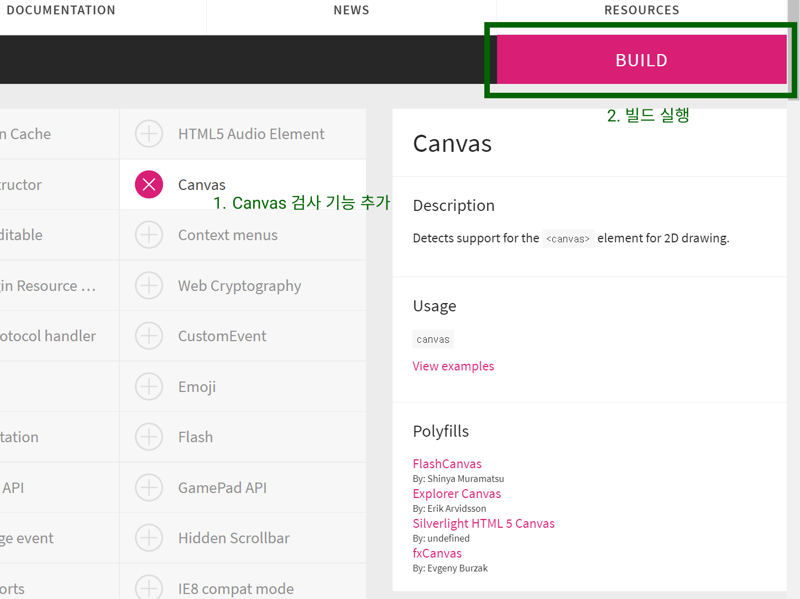
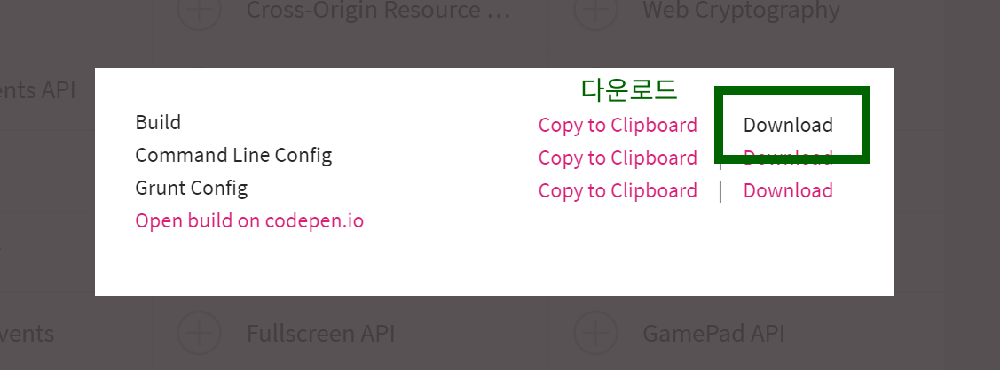
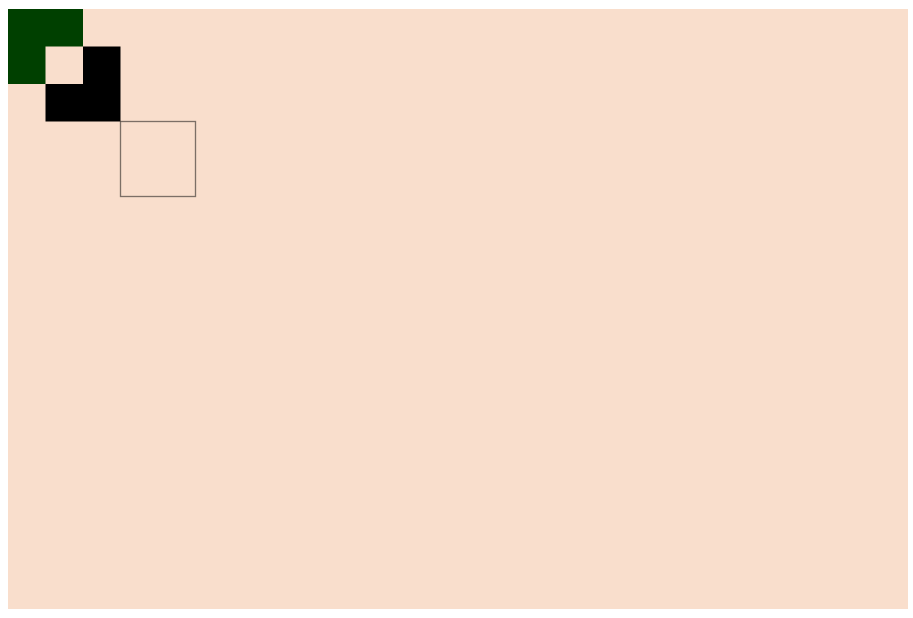
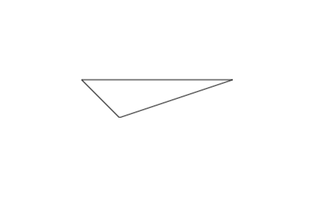

# HTML ``canvas`` 스터디

## 01. ``canvas`` 란?

``canvas``는 ``javascript``를 사용하여 그림을 그릴 수 있는 태그 입니다.

일반적으로 ``2D`` 이미지를 그리는데 사용하며, ``canvas``로 만들어진 ``WebGL`` 라이브러리를 사용하면 ``3D`` 이미지를 그릴 수 있습니다.


<br/><hr/><br/>


## 02. ``Modernizr.js``

우리가 만든 웹 페이지는 사용자의 브라우저에 따라 지원상태가 다릅니다.

사용자의 브라우저가 특정 기능을 지원하는지 여부를 파악할 수 있는 라이브러리가 바로 ``Modernizr.js`` 입니다.

> <a href="https://modernizr.com/" target="_blank">공식 홈페이지: https://modernizr.com/</a>

<br/>

``Modernizr.js``의 특징으로는 원하는 기능만 추가한 상태의 ``Modernizr.js``를 만들 수 있습니다.

<br/>

<br/>

<br/>

<br/>

<br/>

<br/>

사용방법은 다음과 같습니다.

```html
<head>
  <script src="Modernizr 파일"></script>
</head>

<body>
  <canvas></canvas>

  <script>
  if(Modernizr.canvas) {
    // 지원하는 브라우저
  } else {
    // 미지원 브라우저
  }
  </script>
</body>
```


<br/><hr/><br/>


## 03. ``canvas`` 크기 설정

``canvas`` 태그에는 ``width`` 와 ``height`` 속성이 있습니다.

``width`` 속성과 ``height`` 속성은 ``canvas``로 만드는 이미지의 ``Pixel`` 규격을 설정하게 됩니다.

<br/>

만들어진 ``canvas``는 이미지처럼 다룰 수 있는데, 이러한 특징을 사용하여 ``canvas``의 해상도를 ``고해상도``로 만들 수 있습니다.

``canvas``의 ``width 속성``과 ``height 속성``을 실제로 출력할 크기의 ``2배``로 만들고, ``CSS`` 에서는 원래 출력하고자 했던 크기인 ``1배`` 크기로 ``width 스타일``과 ``height 스타일``을 지정하면 됩니다.

예를 들면, ``500 x 250`` 으로 출력할 ``canvas``를 다음과 같이 만드는 것입니다.

```html
<canvas class="myCanvas" width="1000" height="500"></canvas>
```

그리고, 실제로 출력할 크기였던 ``500 x 250``은 ``CSS``로 설정하는 것입니다.

```css
.myCanvas {
  width: 500px;
  height: 250px;
}
```

<br/>

이렇게 만들어진 ``canvas`` 이미지는 원래보다 ``2배 고해상도`` 이미지가 됩니다.

애플에서 인터렉티브 웹을 만들 때 사용하는 ``canvas 기법`` 입니다.

```html
<head>
  <style>
    .myCanvas {
      width: 500px;
      height: 250px;
    }
  </style>
</head>

<body>
  <canvas class="myCanvas" width="1000" height="500"></canvas>
</body>
```


<br/><hr/><br/>


## 04. 사각형 그리기 & 지우기

``<canvas>``를 사용해서 그림을 그리기 위해서는 대상 ``<canvas>``의 ``context`` 객체가 필요 합니다.

``context`` 객체는 ``HTML 요소 접근`` 방법을 통해서 가져올 수 있습니다.

```html
<body>
  <canvas class="myCanvas"></canvas>

  <script>
    const myCanvas = document.querySelector(".myCanvas");
    const context = myCanvas.getContext("2d");
  </script>
</body>
```

<br/>

위의 코드처럼 ``getContext("2d")`` 함수에서 반환된 객체가 ``2D용 context``객체 입니다.

<br/>

이제 사격형을 그리기 위해, 다음 속성과 함수를 사용할 것입니다.

1. ``context.fillStyle 속성``: 색상 설정
2. ``context.fillRect(시작x, 시작y, width값, height값)``: 색이 칠해진 사각형을 그립니다.
3. ``context.strokeRect(시작x, 시작y, width값, height값)``: 사각형 외곽선만 그립니다.
4. ``context.clearRect(시작x, 시작y, width값, height값)``: 사각형을 지웁니다.

```html
<body>
  <canvas class="myCanvas"></canvas>

  <script>
    const myCanvas = document.querySelector(".myCanvas");
    const context = myCanvas.getContext("2d");

    // 사각형 그리기 (검은색)
    context.fillRect(50, 50, 100, 100);

    // rgba(0, 64, 0, 1) 색으로 설정
    context.fillStyle = "rgba(0, 64, 0, 1);

    // 사각형 그리기 (초록색);
    context.fillRect(0, 0, 100, 100);

    // 사각형 지우기
    context.clearRect(50, 50, 50, 50);

    // 사각형 외곽선 그리기
    context.strokeRect(150, 150, 100, 100);
  </script>
</body>
```

<br/>

위 코드의 결과는 다음과 같습니다.

<br/>


<br/><hr/><br/>


## 05. 선 그리기

닫혀있는 도형이 아닌 선을 그리는 방법 입니다.

선을 그리기 위해서는 다음과 같은 ``context`` 메서드를 사용합니다.

1. ``context.beginPath()``: ``선`` 그리기 시작을 알리는 메서드
2. ``context.moveTo(x좌표, y좌표)``: canvas에 그릴 ``붓``의 위치를 이동하는 메서드 입니다.
3. ``context.lineTo(x좌표, y좌쇼)``: 마지막점에서 ``lineTo(x좌표, y좌표)``까지 직선을 그립니다.
    * 실제 화면에 ``Rendering``되지는 않고, ``context.stroke()`` 또는 ``context.fill()`` 메서드를 호출해야 ``Rendering`` 됩니다.
4. ``context.closePath()``: 시작점과 마지막점을 직선으로 연결 합니다.
    * 실제 화면에 ``Rendering``되지는 않고, ``context.stroke()`` 또는 ``context.fill()`` 메서드를 호출해야 ``Rendering`` 됩니다.
5. ``context.stroke()``: 그려진 선을 화면에 ``Rendering`` 합니다.
6. ``context.fill()``: 그려진 도형을 화면에 ``Rendering`` 합니다.
    * 닫힌 도형이 아니면, 아무 동작도 하지 않습니다.

<br/>

```html
<body>
  <canvas class="myCanvas"></canvas>

  <script>
    const myCanvas = document.querySelector(".myCanvas");
    const context = myCanvas.getContext("2d");

    // 선 그리기 시작
    context.beginPath();

    // 붓 이동
    context.moveTo(100, 100);
    // (x좌표, y좌표)까지 직선 그리기
    context.lineTo(300, 100);
    context.lineTo(150, 150);

    // 시작점과 마지막점을 연결하여, 선 그리기 종료
    context.closePath();

    // 그려진 선을 화면에 Rendering
    context.stroke();
  </script>
</body>
```

<br/>

위 코드의 결과는 다음과 같습니다.

<br/>


<br/><hr/><br/>


## 06.