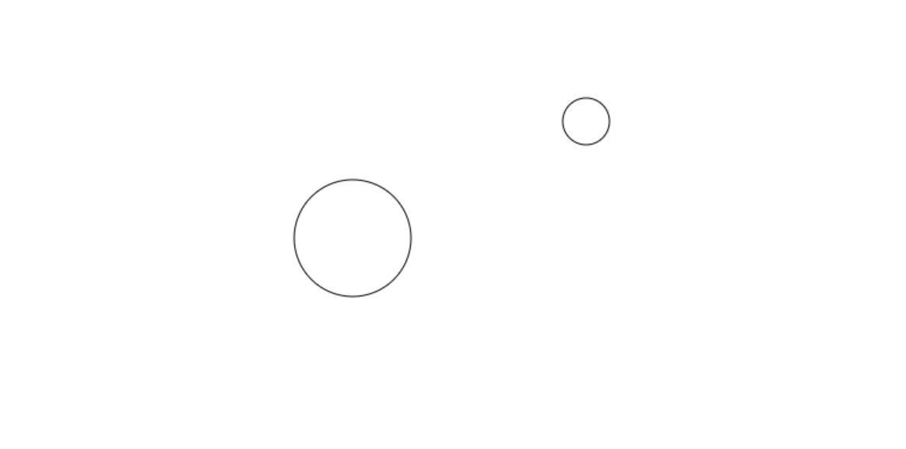
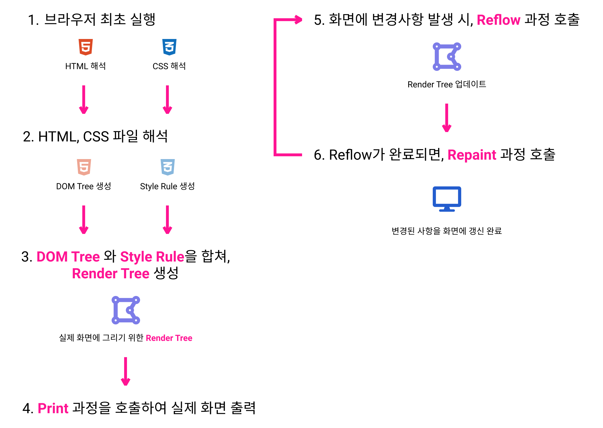
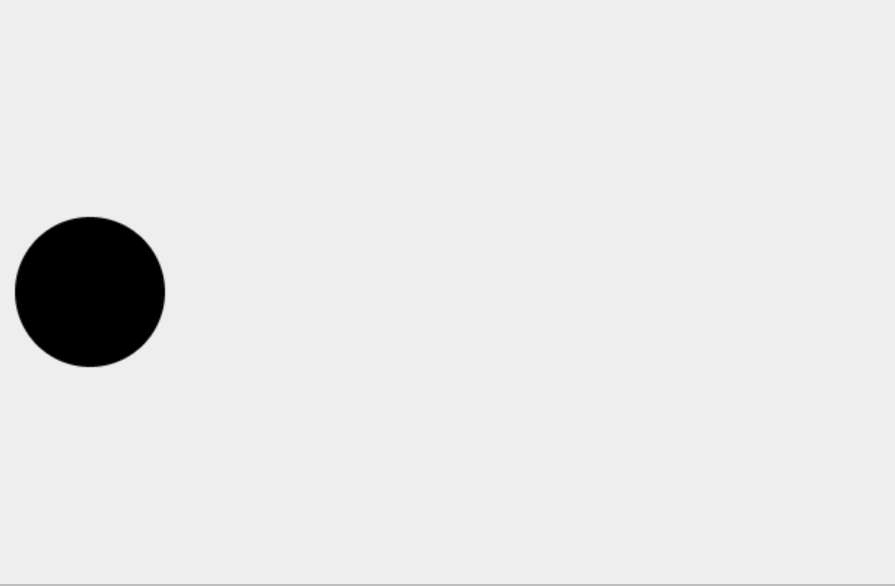
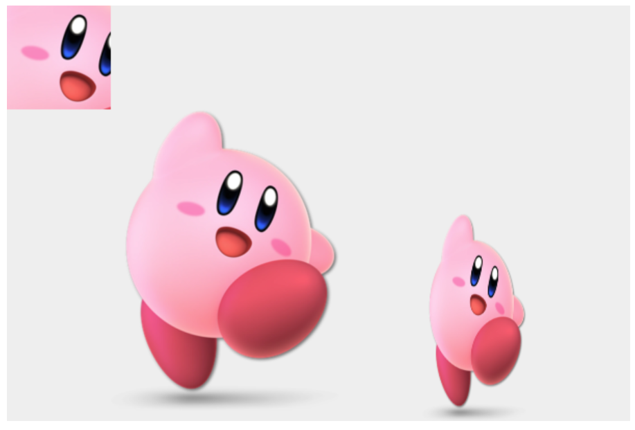
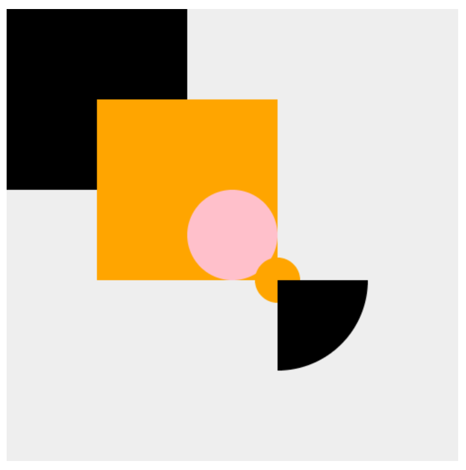
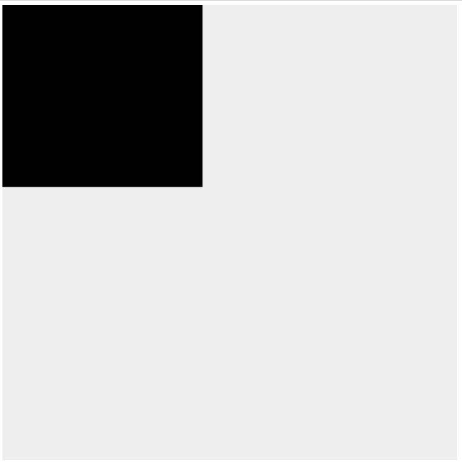
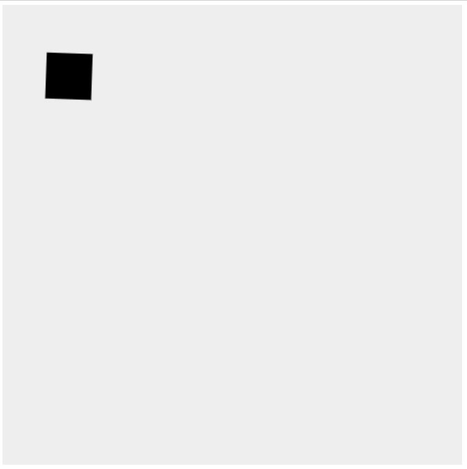
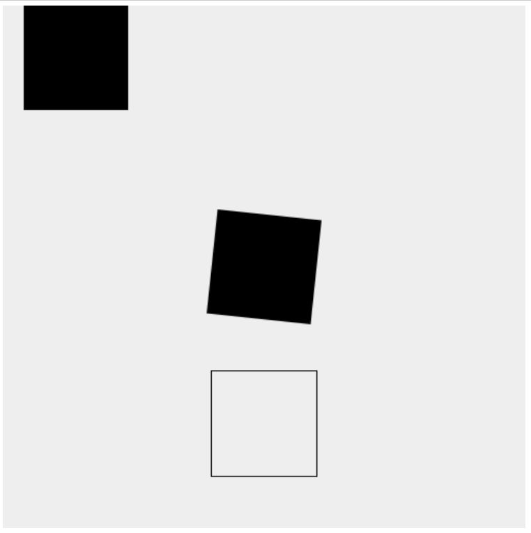

# HTML ``canvas`` 스터디

## 01. ``canvas`` 란?

``canvas``는 ``javascript``를 사용하여 그림을 그릴 수 있는 태그 입니다.

일반적으로 ``2D`` 이미지를 그리는데 사용하며, ``canvas``로 만들어진 ``WebGL`` 라이브러리를 사용하면 ``3D`` 이미지를 그릴 수 있습니다.


<br/><hr/><br/>


## 02. ``Modernizr.js``

우리가 만든 웹 페이지는 사용자의 브라우저에 따라 지원상태가 다릅니다.

사용자의 브라우저가 특정 기능을 지원하는지 여부를 파악할 수 있는 라이브러리가 바로 ``Modernizr.js`` 입니다.

> <a href="https://modernizr.com/" target="_blank">공식 홈페이지: https://modernizr.com/</a>

<br/>

``Modernizr.js``의 특징으로는 원하는 기능만 추가한 상태의 ``Modernizr.js``를 만들 수 있습니다.

<br/>

<br/>

<br/>

<br/>

<br/>

<br/>

사용방법은 다음과 같습니다.

```html
<head>
  <script src="Modernizr 파일"></script>
</head>

<body>
  <canvas></canvas>

  <script>
  if(Modernizr.canvas) {
    // 지원하는 브라우저
  } else {
    // 미지원 브라우저
  }
  </script>
</body>
```


<br/><hr/><br/>


## 03. ``canvas`` 크기 설정

``canvas`` 태그에는 ``width`` 와 ``height`` 속성이 있습니다.

``width`` 속성과 ``height`` 속성은 ``canvas``로 만드는 이미지의 ``Pixel`` 규격을 설정하게 됩니다.

<br/>

만들어진 ``canvas``는 이미지처럼 다룰 수 있는데, 이러한 특징을 사용하여 ``canvas``의 해상도를 ``고해상도``로 만들 수 있습니다.

``canvas``의 ``width 속성``과 ``height 속성``을 실제로 출력할 크기의 ``2배``로 만들고, ``CSS`` 에서는 원래 출력하고자 했던 크기인 ``1배`` 크기로 ``width 스타일``과 ``height 스타일``을 지정하면 됩니다.

예를 들면, ``500 x 250`` 으로 출력할 ``canvas``를 다음과 같이 만드는 것입니다.

```html
<canvas class="myCanvas" width="1000" height="500"></canvas>
```

그리고, 실제로 출력할 크기였던 ``500 x 250``은 ``CSS``로 설정하는 것입니다.

```css
.myCanvas {
  width: 500px;
  height: 250px;
}
```

<br/>

이렇게 만들어진 ``canvas`` 이미지는 원래보다 ``2배 고해상도`` 이미지가 됩니다.

애플에서 인터렉티브 웹을 만들 때 사용하는 ``canvas 기법`` 입니다.

```html
<head>
  <style>
    .myCanvas {
      width: 500px;
      height: 250px;
    }
  </style>
</head>

<body>
  <canvas class="myCanvas" width="1000" height="500"></canvas>
</body>
```


<br/><hr/><br/>


## 04. 사각형 그리기 & 지우기

``<canvas>``를 사용해서 그림을 그리기 위해서는 대상 ``<canvas>``의 ``context`` 객체가 필요 합니다.

``context`` 객체는 ``HTML 요소 접근`` 방법을 통해서 가져올 수 있습니다.

```html
<body>
  <canvas class="myCanvas"></canvas>

  <script>
    const myCanvas = document.querySelector(".myCanvas");
    const context = myCanvas.getContext("2d");
  </script>
</body>
```

<br/>

위의 코드처럼 ``getContext("2d")`` 함수에서 반환된 객체가 ``2D용 context``객체 입니다.

<br/>

이제 사격형을 그리기 위해, 다음 속성과 함수를 사용할 것입니다.

1. ``context.fillStyle 속성``: 색상 설정
2. ``context.fillRect(시작x, 시작y, width값, height값)``: 색이 칠해진 사각형을 그립니다.
3. ``context.strokeRect(시작x, 시작y, width값, height값)``: 사각형 외곽선만 그립니다.
4. ``context.clearRect(시작x, 시작y, width값, height값)``: 사각형을 지웁니다.

```html
<body>
  <canvas class="myCanvas"></canvas>

  <script>
    const myCanvas = document.querySelector(".myCanvas");
    const context = myCanvas.getContext("2d");

    // 사각형 그리기 (검은색)
    context.fillRect(50, 50, 100, 100);

    // rgba(0, 64, 0, 1) 색으로 설정
    context.fillStyle = "rgba(0, 64, 0, 1);

    // 사각형 그리기 (초록색);
    context.fillRect(0, 0, 100, 100);

    // 사각형 지우기
    context.clearRect(50, 50, 50, 50);

    // 사각형 외곽선 그리기
    context.strokeRect(150, 150, 100, 100);
  </script>
</body>
```

<br/>

위 코드의 결과는 다음과 같습니다.

<br/>


<br/><hr/><br/>


## 05. 선 그리기

닫혀있는 도형이 아닌 선을 그리는 방법 입니다.

선을 그리기 위해서는 다음과 같은 ``context`` 메서드를 사용합니다.

1. ``context.beginPath()``: ``선`` 그리기 시작을 알리는 메서드
2. ``context.moveTo(x좌표, y좌표)``: canvas에 그릴 ``붓``의 위치를 이동하는 메서드 입니다.
3. ``context.lineTo(x좌표, y좌쇼)``: 마지막점에서 ``lineTo(x좌표, y좌표)``까지 직선을 그립니다.
    * 실제 화면에 ``Rendering``되지는 않고, ``context.stroke()`` 또는 ``context.fill()`` 메서드를 호출해야 ``Rendering`` 됩니다.
4. ``context.closePath()``: 시작점과 마지막점을 직선으로 연결 합니다.
    * 실제 화면에 ``Rendering``되지는 않고, ``context.stroke()`` 또는 ``context.fill()`` 메서드를 호출해야 ``Rendering`` 됩니다.
5. ``context.stroke()``: 그려진 선을 화면에 ``Rendering`` 합니다.
6. ``context.fill()``: 그려진 도형을 화면에 ``Rendering`` 합니다.
    * 닫힌 도형이 아니면, 아무 동작도 하지 않습니다.

<br/>

```html
<body>
  <canvas class="myCanvas"></canvas>

  <script>
    const myCanvas = document.querySelector(".myCanvas");
    const context = myCanvas.getContext("2d");

    // 선 그리기 시작
    context.beginPath();

    // 붓 이동
    context.moveTo(100, 100);
    // (x좌표, y좌표)까지 직선 그리기
    context.lineTo(300, 100);
    context.lineTo(150, 150);

    // 시작점과 마지막점을 연결하여, 선 그리기 종료
    context.closePath();

    // 그려진 선을 화면에 Rendering
    context.stroke();
  </script>
</body>
```

<br/>

위 코드의 결과는 다음과 같습니다.

<br/>


<br/><hr/><br/>


## 06. 원호 그리기

``Circular Arc``의 뜻은 ``원호`` 입니다.

``context`` 객체의 ``arc()`` 메서드가 바로 ``원호``를 그리는 메서드 입니다.

그리는 원리는 ``선 그리기(lineTo())``와 비슷하며, 필요한 인자가 ``원호``를 그리기 위한 값일 뿐입니다.

``원호``를 그리는데 ``360도``만큼 그리면 원이 되므로, 원을 그릴때 역시 ``context.arc()`` 메서드를 사용합니다.

원호를 그리기위한 메서드는 다음과 같습니다.

1. ``context.beginPath()``: 선 그리기를 시작 합니다.
2. ``context.arc(중심점x, 중심점y, 반지름, 시작각도(Radian값), 끝각도(Radian값), 반시계 회전 여부? = false);
3. ``context.stroke()``: 그려진 호를 ``Rendering``

```html
<body>
  <canvas class="myCanvas" width="600" height="400"></canvas>

  <script>
    // 각도를 Radian값으로 변환 메서드
    function toRadian(deg) {
      return deg * (Math.PI / 180);
    }
    
    const myCanvas = document.querySelector(".myCanvas");
    const context = myCanvas.getContext("2d");

    // 선 그리기 시작
    context.beginPath();
    // 원호 그리기 (시계방향 그리기)
    context.arc(300, 200, 50, toRadian(0), toRadian(360), false);
    // Rendering 실행
    context.stroke();

    // 선 그리기 시작
    context.beginPath();
    // 원호 그리기 (반시계 방향 그리기)
    context.arc(500, 100, 25, toRadian(0), toRadian(180), true);
    // Rendering 실행
    context.stroke();
  </script>
</body>
```

<br/>

위 코드의 결과는 다음과 같습니다.

<br/>


<br/><hr/><br/>


## 07. 브라우저 Rendering 과정

다음 챕터에서 알아볼 Animation을 위해, 브라우저의 Rendering 방식에 대해 알아보겠습니다.

웹 페이지는 ``HTML`` 파일과 ``CSS`` 파일에 의해 화면을 출력 합니다.

<br/>

브라우저는 ``HTML`` 파일을 해석한 ``DOM Tree``와 ``CSS`` 파일을 해석한 ``Style Rule``을 사용하여 ``Render Tree``를 만듭니다.

만들어진 ``Render Tree``는 화면에 실제로 보이는 요소와 스타일만 가진 결과물이며, ``Print`` 과정에 의해 화면에 최초 출력 됩니다.

<br/>

이제 화면에 변화가 생기면, ``Reflow`` 과정이 호출되고, ``Reflow`` 과정에 의해 변경된 ``Render Tree``가 Update 됩니다.

<br/>

Update 된 ``Render Tree``는 ``Repaint`` 과정이 호출되어, 실제 화면이 변경되게 됩니다.

<br>

이러한 과정을 도식화 하면 다음과 같습니다.

<br/>


<br/><hr/><br/>


## 08. ``window.requestAnimationFrame()`` 를 사용한 Animation

웹에서 Animation을 구현할 때는, ``window.requestAnimationFrame(callback)`` 을 사용합니다.

``requestAnimationFrame(callback)`` 메서드는 Animation에 대한 최적화를 지원하기 때문에, ``window.setInterval()`` 보다 뛰어난 Animation을 구현할 수 있습니다.

``requestAnimationFrame(callback)``의 특징은 다음과 같습니다.

* 브라우저에 Animation 함수를 알립니다.
* ``Repain`` 호출 전, 해당 Animation ``Callback`` 함수를 호출해 줍니다.
* ``1/60`` 프레임의 Animation을 출력합니다.
* Animation을 출력할 때 발생할 수 있는 ``프레임 유실`` 또는 ``버퍼링``을 해소해 줍니다.

<br/>

다음 코드는 ``requestAnimationFrame(callback)`` 을 사용한 Animation 구현 예제 입니다.

```html
<body>
  <canvas class="myCanvas" width="600" height="400"></canvas>

  <script>
    const myCanvas = document.querySelector(".myCanvas");
    const context = myCanvas.getContext("2d");

    let dir = 1;
    let xPos = 50;

    function draw() {
      context.clearRect(0, 0, 600, 400);

      context.beginPath();
      context.arc(xPos, 200, 50, 0, Math.PI * 2);
      context.fill();

      xPos += 10 * dir;

      if(xPos >= (600 - 50) || xPos <= 50) {
        dir *= -1;
      }

      requestAnimationFrame(draw);
    }

    draw();
  </script>
</body>
```

<br/>

위 코드의 실행결과는 다음과 같습니다.

<br/>


<br/><hr/><br/>


## 09. Animation 프레임 설정

``requestAnimationFrame(callback)`` 에는 별도의 ``Frame`` 설정 기능을 제공하지 않습니다.

때문에, ``1/60 초``마다 실행되는 ``requestAnimationFrame(callback)``의 ``Frame``을 우리가 만들어야 합니다.

<br/>

``Frame``을 만드는 방법은 간단합니다.

``requestAnimationFrame(callback)``을 호출할 때마다, ``Frame Count``를 증가 시키고, 원하는 조건의 ``Frame Count``일 때만, 재귀호출을 하도록 하면 ``Frame``이 구현 됩니다.

```html
<body>
  <canvas class="myCanvas" width="600" height="400"></canvas>

  <script>
    const myCanvas = document.querySelector(".myCanvas");
    const context = myCanvas.getContext("2d");

    const moveDist = 10;
    const radius = 50;

    let dir = 1;
    let xPos = radius;

    // Frame 개수
    let frameCount = 0;

    function draw() {
      // frameCount 가 3의 배수일 때만 다음 장면 그리기
      if(frameCount % 3 === 0) {
        context.clearRect(0, 0, 600, 400);

        context.beginPath();
        context.arc(xPos, 200, radius, 0, Math.PI * 2);
        context.fill();

        xPos += (moveDist * dir);
        if(xPos >= (600 - radius) || xPos <= radius) {
          dir *= -1;
        }
      }

      frameCount++;

      if(frameCount === 60) {
        frameCount = 0;
      }

      requestAnimationFrame(draw);
    }

    draw();
  </script>
</body>
```


<br/><hr/><br/>


## 10. ``requestAnimationFrame()`` 정지 시키기

``requestAnimationFrame(callback)`` 메서드는 반환값으로 ``requestAnimationFrame() 식별 ID``를 줍니다.

만약 ``requestAnimationFrame(callback)``을 정지 시키려면, ``window.cancelAnimationFrame(식별ID)``를 사용하여 정지 시킬 수 있습니다.

다음은 ``<canvas>`` 클릭 시, Animation을 정지 시키는 예시 코드 입니다.

```html
<body>
  <canvas class="myCanvas" width="600" height="400" onclick="stopAnimation()"</canvas>

  <script>
    const myCanvas = document.querySelector(".myCanvas");
    const context = myCanvas.getContext("2d");

    const radius = 50;
    const moveDist = 10;

    let dir = 1;
    let xPos = radius;

    let animationId = -9999;

    function draw() {
      context.clearRect(0, 0, 600, 400);

      context.beginPath();
      context.arc(xPos, 200, radius, 0, Math.PI * 2);
      context.fill();

      xPos += (radius * dir);

      if(xPos >= (600 - radius) || xPos <= radius) {
        dir *= -1;
      }

      animationId = requestAnimationFrame(draw);
    }

    function stopAnimation() {
      cancelAnimationFrame(animationId);
    }

    draw();
  </script>
</body>
```


<br/><hr/><br/>


## 11. ``<canvas>``에 ``Image`` 그리기

지금까지 알아보았던 도형 그리기는 복잡한 이미지는 그리기 어렵습니다.

때문에 이미지 파일을 ``<canvas>``에 그려서 사용하게 되는데, 이번에는 ``Image`` 파일을 ``<canvas>``에 그리는 방법에 대해 알아보겠습니다.

<br/>

``<canvas>``객체의 ``context.drawImage()`` 메서드를 사용하여, ``Image``를 그릴 수 있습니다.

``context.drawImage()``에 전달할 ``Image``는 ``HTMLImageElement``로 전달하게 됩니다.

``context.drawImage()``의 형식은 다음과 같습니다.

* ``drawImage(imgElement, 시작x, 시작y)``
* ``drawImage(imgElement, 시작x, 시작y, imgWidth, imgHeight)``
* ``drawImage(imgElement, clop시작x, clop시작y, clopWidth, clopHeight, 시작x, 시작y, imgWidth, imgHeight)``

위 스펙을 보면, ``Image``의 일부분을 ``Clop``할 수 있는 기능도 사용할 수 있습니다.

<br/>

다음 코드는 ``<canvas>``에 ``Image``를 그리는 예시 코드 입니다.

```html
<body>
    <canvas class="myCanvas" width="600" height="400"></canvas>

    <script>
      const myCanvas = document.querySelector(".myCanvas");
      const context = myCanvas.getContext("2d");

      const imgElement = new Image();
      imgElement.src = "./Kirby.png";

      imgElement.addEventListener("load", () => {
        // img 그대로 출력
        context.drawImage(imgElement, 100, 100);
        
        // img 의 크기 지정
        context.drawImage(imgElement, 400, 200, 100, 200);

        // img 의 일부분 clop
        context.drawImage(imgElement, 50, 50, 100, 100, 0, 0, 100, 100);
      })
    </script>
  </body>
```

<br/>

위 코드의 결과는 다음과 같습니다.

<br/>


<br/><hr/><br/>


## 12. ``<video>`` 와 ``<canvas>``

``HTML``의 ``<video>``태그를 사용하면 웹에 영상을 출력할 수 있습니다.

만약, ``<video>``에 효과나 수정을 만든다면 ``<canvas>``에 ``<video>``를 그려서 구현할 수 있습니다.

<br/>

``<canvas>``에 ``<video>``를 그리는 방법은 이미지와 동일한 ``context.drawImage()``를 사용 합니다.

```` 그리기와 차이점은 ``<video>``를 그리는 ``Event``가 다릅니다.

* ``canplaythrough`` 이벤트

<br/>

``canplaythrough`` 이벤트는 ``<video>`` 요소에서 발생하며, 발생 시점은 사용자의 브라우저에서 ``<video>``를 버퍼링 없이 전체 재생할 수 있는 시점 입니다.

<br/>

아래 코드는 ``<video>``태그의 영상을 ``<canvas>``에 출력한 예시 입니다.

```html
<head>
  <style>
    /* <video>는 화면에 출력하지 않음 */
    .myVideo {
      position: absolute;
      width: 0;
      height: 0;
    }
  </style>
</head>

<body>
  <video src="영상" autoplay muted loop class="myVideo"></video>

  <canvas class="myCanvas" width="600" height="400"></canvas>

  <script>
    const myVideo = document.querySelector(".myVideo");
    const myCanvas = document.querySelector(".myCanvas");
    const context = myCanvas.getContext("2d");

    function draw() {
      context.drawImage(myVideo, 0, 0, 600, 400);
      requestAnimationFrame(draw);
    }

    myVideo.addEventListener("canplaythrough", draw);
  </script>
</body>
```


<br/><hr/><br/>


## 13. ``<video>`` 자막넣기

``<video>``를 ``<canvas>``에 그리게 되면, 자막처럼 효과를 추가할 수 있습니다.

자막을 달기 위해서는 ``<video>``의 ``현재 재생시간``을 알아야 하는데, 이는 ``HTMLVideoElement.currentTime`` 속성으로 얻을 수 있습니다.

``HTMLVideoElement.currentTime``의 값은 ``초 단위`` Number 이며, 소수점까지 알 수 있습니다.

<br/>

다음은 시간별로 자막을 추가한 예시 코드 입니다.

```html
<head>
  <style>
    .myVideo {
      position: absolute;
      width: 0;
      height: 0;
    }

    .myCanvas {
      background-color: #eee;
    }
  </style>
</head>

<body>
  <video class="myVideo" autoplay muted loop src="영상"></video>

  <canvas class="myCanvas" width="600" height="400"></canvas>

  <script>
    const myVideo = document.querySelector(".myVideo");
    const myCanvas = document.querySelector(".myCanvas");
    const context = myCanvas.getContext("2d");

    context.font = "bold 50px san-serif";
    context.fillStyle = "#ff0000";

    const msgList = [
      { msg: "1. 자막 입니다", time: 1, x: 100, y: 50 },
      { msg: "2. Hello World", time: 2, x: 200, y: 100 },
      { msg: "3. 안녕하세요", time: 3, x: 300, y: 200 },
    ]

    function draw() {
      context.drawImage(myVideo, 0, 0, 600, 400);

      const currentTime = myVideo.currentTime;

      for(let i = 0; i < msgList.length; i++) {
        const msgObj = msgList[i];

        if(currentTime >= msgObj.time) {
          context.fillText(msgObj.msg, msgObj.x, msgObj.y);
        }
      }

      requestAnimationFrame(draw);
    }

    myVideo.addEventListener("canplaythrough", draw);
  </script>
</body>
```


<br/><hr/><br/>


## 14. ``canvas``의 ``pixel`` 색 변경

``<canvas>``는 ``Pixel``단위로 색을 변경할 수 있습니다.

각 ``Pixel``의 색상값을 가져오기 위해서는 ``context.getImageData(시작x, 시작y, width, height)`` 메서드를 사용하여 가져올 수 있습니다.

```javascript
const myCanvas = document.querySelector(".myCanvas");
const context = myCanvas.getContext("2d");

const imageData = context.getImageData(0, 0, 600, 400);
```

<br/>

위 예시는 ``(0, 0) ~ (600, 400)`` 영역의 ``image data``를 가져온 것입니다.

``가져온 imageData``는 다음과 같은 객체 입니다.

```typescript
const imageData: {
  // imageData 영역의 width값
  width: number;

  // imageData 영역의 height값
  height: number;

  // imageData 영역의 pixel별 색상값
  data: number[];
} = [];
```

<br/>

그리고 각 ``Pixel``의 실제 ``색상값``은 ``data`` 속성으로 얻게 됩니다.

``data`` 속성은 ``number[]`` 타입인데, 값 4개씩 짝으로 ``rgba``의 값을 나타냅니다.

즉, ``data[0]``의 값은 ``0번 Pixel의 r값``을 나타냅니다.

<br/>

현재 출력된 ``<canvas>``의 Pixel 단위 색상을 변경할 때는 ``imageData.data``를 수정하여 구현할 수 있고,

변경한 ``imageData.data``를 적용 시키기 위해서는 ``context.putImageData()`` 메서드를 호출해야 반영 됩니다.

<br/>

다음은 ``<canvas>``에 재생되는 영상의 버튼별로 변경하는 예제 입니다.

```html
<head>
  <style>
    .myVideo {
      position: absolute;
      width: 0;
      height: 0;
    }

    .myCanvas {
      background-color: #eee;
    }
  </style>
</head>

<body>
  <video src="영상" autoplay muted loop class="myVideo"></video>

  <canvas class="myCanvas" width="600" height="400"></canvas>

  <div class="controller">
    <button data-color="red">R</button>
    <button data-color="green">G</button>
    <button data-color="blue">B</button>
    <button data-color="">RESET</button>
  </div>

  <script>
    const myVideo = document.querySelector(".myVideo");
    const myCanvas = document.querySelector(".myCanvas");
    const context = myCanvas.getContext("2d");

    let colorVal = "";

    function draw() {
      context.drawImage(myVideo, 0, 0, 600, 400);

      const imageData = context.getImageData(0, 0, 600, 400);
      const pixelData = imageData.data;
      const pixelLength = pixelData.length;

      for(let i = 0; i < pixelLength; i++;) {
        switch(colorVal) {
          case "red": {
            pixelData[i * 4 + 0] = 255;
            break;
          }

          case "green": {
            pixelData[i * 4 + 1] = 255;
            break;
          }

          case "blue": {
            pixelData[i * 4 + 2] = 255;
            break;
          }
        }
      }

      context.putImageData(imageData, 0, 0);
      requestAnimationFrame(draw);
    }

    myVideo.addEventListener("canplaythrough", draw);

    controller.addEventListener("click", (event) => {
      const targetElement = event.target;
      colorVal = targetElement.getAttribute("data-color");
    });
  </script>
</body>
```


<br/><hr/><br/>


## 15. ``canvas``의 ``save()`` 와 ``restore()``

``<canvas>``에도 변화기능이 있습니다.

모양, 크기, 색 등 다양한 변화를 줄 수 있습니다.

<br/>

``transform`` 기능을 알아보기 전에, 먼저 ``<canvas>``의 상태를 저장하고 불러오는 기능에 대해 알아 보겠습니다.

<br/>

``<canvas>``의 ``context``에는 ``save()`` 메서드와 ``restore()`` 메서드가 있습니다.

``save()`` 메서드는 현재 ``<canvas>``의 상태를 ``Stack``에 저장 합니다.

``save()`` 메서드로 저장된 ``<canvas>``의 상태는 ``restore()`` 메서드로 불러올 수 있습니다.

중요한 점은 ``save()`` 와 ``restore()``는 ``Stack`` 방식으로 동작한다는 것입니다.

<br/>

다음은 ``save()`` 와 ``restore()`` 에 대한 예시 입니다.

```html
<head>
  <style>
    .myCanvas {
      background-color: #eee;
    }
  </style>
</head>

<body>
  <canvas class="myCanvas" width="500" height="500"></canvas>

  <script>
    const myCanvas = document.querySelector(".myCanvas");
    const context = myCanvas.getContext("2d");

    context.fillRect(0, 0, 200, 200);

    // <canvas> 상태 저장
    context.save();

    context.fillStyle = "orange";
    context.fillRect(100, 100, 200, 200);

    // <canvas> 상태 저장
    context.save();

    context.fillStyle = "pink";
    context.beginPath();
    context.arc(250, 250, 50, 0, Math.PI * 2);
    context.fill();

    // Stack에서 <canvas> 상태 불러오기 "orange"
    context.restore();

    context.beginPath();
    context.arc(300, 300, 25, 0, Math.PI * 2);
    context.fill();

    // Stack에서 <canvas> 상태 불러오기 "black"
    context.restore();

    context.beginPath();
    context.arc(300, 300, 100, 0, Math.PI * (2 / 4));
    context.lineTo(300, 300);
    context.fill();
  </script>
</body>
```

<br/>

위 코드를 실행하면 다음과 같은 결과를 얻을 수 있습니다.

<br/>


<br/><hr/><br/>


## 16. ``<canvas>``의 ``transform``

``<canvas>`` 의 ``transform`` 에는 다음 3가지 기능이 있습니다.

1. ``translate(x좌표, y좌표)``: Canvas의 ``원점 이동`` 메서드 입니다.
2. ``rotate(각도)``: 원점을 기준으로 ``회전`` 시키는 메서드 입니다.
3. ``scale(수평 배율, 수직 배율)``: Canvas의 ``그리드 단위``를 키우거나 줄이는 메서드 입니다.

<br/>

위 3가지 메서드에 대한 예시 코드는 다음과 같습니다.

```html
<head>
  <style>
    .myCanvas {
      background-color: #eee;
    }
  </style>
</head>

<body>
  <canvas class="myCanvas" width="500" height="500"></canvas>

  <script>
    const myCanvas = document.querySelector(".myCanvas");
    const context = myCanvas.getContext("2d");

    function draw() {
      context.clearRect(0, 0, 500, 500);
      
      context.fillRect(0, 0, 200, 200);
      context.translate(10, 0);

      requestAnimationFrame(draw);
    }

    draw();
  </script>
</body>
```

<br/>

위 코드를 실행하면, 도형을 그리는 x 좌표가 변하는 것을 알 수 있습니다.

<br/>

<br/>

하지만, 의도했던 도형이 움직이는 Animation이 아닌, 줄을 긋는 Animation 처럼 되었습니다.

이유는 ``transform()`` 메서드는 ``canvas``의 ``원점``을 이동 시키므로, ``clearRect(0, 0, 500, 500)`` 의 좌표가 ``transform()`` 이 적용된 후의 ``(0, 0)``을 지우기 때문에, ``transform()`` 이전 위치를 지우지 못하기 때문입니다.

<br/>

다음은 ``rotate(각도)`` 메서드의 예시 코드 입니다.

```html
<head>
  <style>
    .myCanvas {
      background-color: #eee;
    }
  </style>
</head>

<body>
  <canvas class="myCanvas" width="500" height="500"></canvas>

  <script>
    const myCanvas = document.querySelector(".myCanvas");
    const context = myCanvas.getContext("2d");

    function toRadius(deg) {
      return deg * (Math.PI / 180);
    }

    function draw() {
      context.fillRect(50, 50, 50, 50);
      context.rotate(toRadius(1));

      requestAnimationFrame(draw);
    }

    draw();
  </script>
</body>
```

<br/>

위 코드를 실행한 결과는 다음과 같습니다.

<br/>

<br/>

``rotate()`` 예제 역시, 우리가 의도했던 사각형의 회전이 아닌, ``원점``을 중심으로 사격형이 회전하고 있습니다.

<br/>

마지막으로 ``scale(x배율, y배율)`` 에 대한 예시 코드 입니다.

```html
<head>
  <style>
    .myCanvas {
      background-color: #eee;
    }
  </style>
</head>

<body>
  <canvas class="myCanvas" width="500" height="500"></canvas>

  <script>
    const myCanvas = document.querySelector(".myCanvas");
    const context = myCanvas.getContext("2d");

    function draw() {
      context.clearRect(0, 0, 500, 500);

      context.fillRect(200, 200, 200, 200);
      context.scale(1.01, 1.01);

      requestAnimationFrame(draw);
    }

    draw();
  </script>
</body>
```

<br/>

위 코드를 실행해 보면, 다음과 같습니다.

<br/>

<br/>

``rotate(x배율, y배율)`` 메서드 역시, ``원점(0, 0)``을 기준으로 커지는 문제가 있습니다.

<br/>

지금까지의 문제점은 모두 ``transform의 기준점``에 대한 문제 입니다.

``<canvas>``의 모든 ``transform`` 메서드는 ``기준점``에서 동작되는데, 이 기준점의 위치를 변경하거나 ``초기화(원점)`` 를 필요에 따라 적용시켜야 합니다.

``기준점``의 초기화는 ``context.resetTransform()`` 메서드를 사용하여 실행할 수 있습니다.

``transform`` 메서드는 현재 ``기준점``에서 반영되므로, 절대좌표로써 ``transform``을 적용 시키려면, ``resetTransform()`` 을 호출 후 변형을 시켜야 합니다.

<br/>

그리고 ``transform``을 일괄 적용 시킬 수 있는 메서드는 다음 두가지가 있습니다.

1. ``transform(a, b, c, d, e, f)`` 
2. ``setTransform(a, b, c, d, e, f)`` 

위 두 메서드는 ``행렬`` 연상방법을 사용하며, ``transform`` 전체를 일괄 적용 시킬 수 있는 메서드 입니다.

``transform()`` 메서드는 현재 상태에서 ``transform``을 적용 시키고, ``setTransform()`` 메서드는 현재 ``transform``을 ``초기화`` 한 후, 적용 시키는 차이가 있습니다.

<br/>

마지막으로 ``setTransform(1, 0, 0, 1, 0, 0)``을 호출하게 되면, 행열 연산에 의해 ``resetTransform()`` 과 동일하게 ``초기화`` 동작이 됩니다.

<br/>

그럼 지금까지 예시의 문제점을 개선한 방법으로 코딩해 보겠습니다.

```html
<head>
  <style>
    .myCanvas {
      background-color: #eee;
    }
  </style>
</head>

<body>
  <canvas class="myCanvas" width="500" height="500"></canvas>

  <script>
    const myCanvas = document.querySelector(".myCanvas");
    const context = myCanvas.getContext("2d");

    // 프레임당 이동 거리
    const translateUnit = 10;
    // 이동 방향
    let translateDir = 1;
    // 현재 x축 위치
    let curX = 0;

    // 이동하는 사각형 그리기 메서드
    function drawTranslateRect() {
      context.translate(curX, 0);

      context.fillRect(0, 0, 100, 100);

      curX += translateUnit * translateDir;

      if(curX >= 400) {
        translateDir = -1;
      } else if(curX <= 0) {
        translateDir = 1;
      }
    }

    // 프레임당 회전 단위
    const rotateUnit = Math.PI / 180 * 3;
    // 현재 회전 각도
    let curDeg = 0;

    // 회전하는 사각형 그리기 메서드
    function drawRotateRect() {
      context.translate(250, 250);
      context.rotate(curDeg);

      // translate() 가 적용된 원점에서 (-50, -50) 위치에 사각형 그리기
      context.fillRect(-50, -50, 100, 100);

      curDeg += rotateUnit;

      if(curDeg >= 360) {
        curDeg = 0;
      }
    }

    // 프레임당 배율
    const scaleUnit = 0.005;
    // 배율 방향
    let scaleDir = 1;
    // 현재 배율
    let curScale = 1;

    // 배율 사각형 그리기 메서드
    function drawScaleRect() {
      context.translate(250, 400);
      context.scale(curScale, curScale);

      context.strokeRect(-50, -50, 100, 100);

      curScale += scaleUnit * scaleDir;

      if(curScale >= 1.5) {
        scaleDir = -1;
      } else if(curScale <= 1) {
        scaleDir = 1;
      }
    }

    // Animation Frame
    let frame = 0;

    function draw() {
      if(frame % 3 === 0) {
        // 이전 transform 상태값 초기화
        context.resetTransform();
        context.clearRect(0, 0, myCanvas.width, myCanvas.height);

        drawTranslateRect();

        // 이전 transform 상태값 초기화
        context.resetTransform();
        drawRotateRect();

        // 이전 transform 상태값 초기화
        context.resetTransform();
        drawScaleRect();
      }

      frame++;

      if(frame >= 60) {
        frame = 0;
      }

      requestAnimationFrame(draw);
    }

    draw();
  </script>
</body>
```

<br/>

<br/>

<br/>

위 코드의 가장 큰 특징은, 각 도형을 그릴 때, 이전 ``transform`` 상태값을 ``resetTransform()`` 메서드로 초기화 한 후, 각 도형에 맞게 ``transform`` 을 변경한다는 점 입니다.

``transform`` 은 현재 상태에서 변형 시키는 기능이기 때문에, 매번 초기화를 해 줘야 ``상태의 절대값``으로 작성할 수 있기 때문입니다.


<br/><hr/><br/>


## 17.